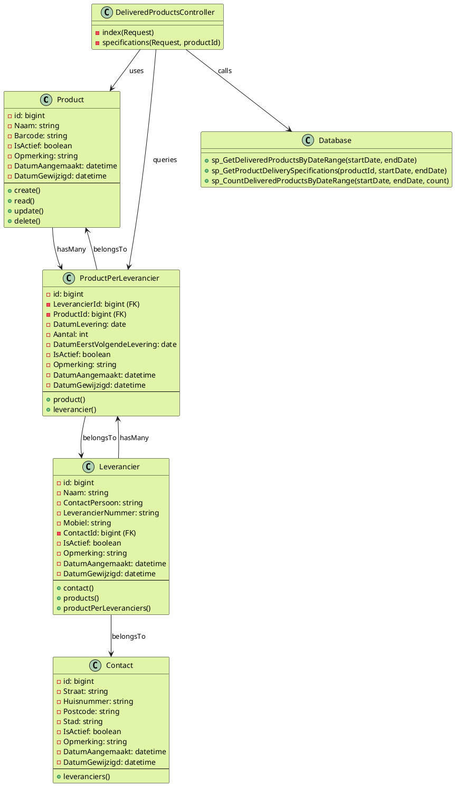

# Class Diagram - User Story 01: Overzicht Geleverde Producten

## PlantUML Diagram

## Class Description

### Models

#### Product
- **Purpose**: Represents a product/candy item in the warehouse
- **Attributes**: 
  - `Naam`: Product name (e.g., "Mintnopjes")
  - `Barcode`: Product barcode
  - `IsActief`: Whether the product is active
- **Relationships**: Has many ProductPerLeveranciers

#### Leverancier (Supplier)
- **Purpose**: Represents a supplier/vendor
- **Attributes**:
  - `Naam`: Supplier name
  - `ContactPersoon`: Contact person name
  - `LeverancierNummer`: Supplier number
  - `Mobiel`: Phone number
  - `ContactId`: Foreign key to Contact
- **Relationships**: 
  - BelongsTo Contact
  - HasMany ProductPerLeveranciers
  - HasMany Products (through ProductPerLeverancier)

#### ProductPerLeverancier
- **Purpose**: Junction table that tracks product deliveries from suppliers
- **Attributes**:
  - `DatumLevering`: Delivery date
  - `Aantal`: Quantity delivered
  - `DatumEerstVolgendeLevering`: Next scheduled delivery date
- **Relationships**: 
  - BelongsTo Product
  - BelongsTo Leverancier

#### Contact
- **Purpose**: Represents contact information for suppliers
- **Attributes**: Address details (Straat, Huisnummer, Postcode, Stad)
- **Relationships**: HasMany Leveranciers

### Controllers

#### DeliveredProductsController
- **Purpose**: Handles HTTP requests for delivered products overviews
- **Methods**:
  - `index(Request)`: Displays overview of delivered products within date range
  - `specifications(Request, productId)`: Displays delivery specifications for a specific product

### Database Layer
- **sp_GetDeliveredProductsByDateRange**: Stored procedure to retrieve all delivered products within a date range
- **sp_GetProductDeliverySpecifications**: Stored procedure to retrieve delivery details for a specific product
- **sp_CountDeliveredProductsByDateRange**: Stored procedure to count delivered products in a date range

---

## Interaction Flow

1. **Scenario 01 - Overview**:
   - User navigates to `/delivered-products`
   - DeliveredProductsController->index() is invoked
   - User enters start and end dates
   - Controller calls `sp_GetDeliveredProductsByDateRange`
   - Results are paginated (4 items per page)
   - View displays sorted results by supplier name

2. **Scenario 02 - Specifications**:
   - User clicks "?" button on a product row
   - DeliveredProductsController->specifications() is invoked
   - Controller calls `sp_GetProductDeliverySpecifications`
   - View displays delivery dates and quantities for that product
   - Pagination applied to delivery history

3. **Scenario 03 - No Results**:
   - User enters date range with no deliveries
   - `sp_GetDeliveredProductsByDateRange` returns empty result
   - Controller sets message variable
   - View displays: "Er zijn geen leveringen geweest van producten in deze periode"
